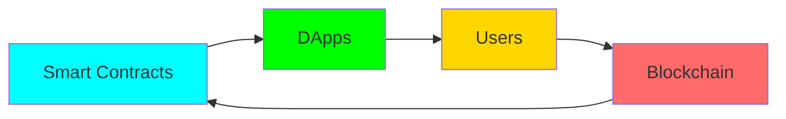

</div>

---

<div align="center">

## 🌐 『 DIMENSIONAL GATEWAY 』

[](https://your-portfolio.com)
[](https://linkedin.com/in/fa1z/)
[](https://twitter.com/faiztwts)
[](https://discord.gg/your-server)
[](mailto:faizannkhan72@gmail.com)

</div>

---

<div align="center">

## 🎯 『 MISSION OBJECTIVE 』

</div>
```ascii
╔══════════════════════════════════════════════════════════════╗
║  > DEPLOYING DECENTRALIZED APPLICATIONS...                   ║
║  > COMPILING SMART CONTRACTS...                              ║
║  > SECURING THE BLOCKCHAIN...                                ║
║  > REVOLUTIONIZING WEB3...                            [OK]   ║
╚══════════════════════════════════════════════════════════════╝
```

<div align="center">
```diff
+ 🔐 Smart Contract Engineer specializing in Solidity & EVM
+ 🌐 Full-Stack Web3 Developer | React + Ethers.js + Hardhat
+ ⛓️ Building the decentralized infrastructure of tomorrow
+ 🚀 Transforming Web2 into Web3, one dApp at a time
+ 📍 Transmission Point: Pimpri, Maharashtra, India
```

</div>

---

<div align="center">

## ⚙️ 『 TECHNOLOGY ARSENAL 』

### ⚡ CORE PROGRAMMING PROTOCOLS


### 🔗 BLOCKCHAIN INFRASTRUCTURE


### 🌐 FRONTEND QUANTUM LAYER


### 🛠️ DEVELOPMENT ECOSYSTEM


</div>

---

<div align="center">

## 📊 『 SYSTEM ANALYTICS 』


</div>

---

<div align="center">

## 🏗️ 『 DECENTRALIZED CONSTRUCTS 』

</div>

<table align="center">
<tr>
<td width="50%">

### 🔐 SMART CONTRACT VAULT
```solidity
// ERC-20 Token Engineering
// NFT Marketplace Architecture  
// DeFi Protocol Development
// DAO Governance Systems
// Multi-Sig Wallet Solutions
```

</td>
<td width="50%">

### 🌐 DAPP ECOSYSTEM
```javascript
// React + Web3.js Integration
// MetaMask Connection Layer
// Real-time Blockchain Data
// IPFS Storage Solutions
// Wallet Authentication
```

</td>
</tr>
</table>

<div align="center">

### 🚀 FEATURED DEPLOYMENTS

| PROJECT | TECH STACK | STATUS | CHAIN |
|---------|-----------|--------|-------|
| 🪙 **Token Forge** | Solidity, Hardhat, OpenZeppelin | 🟢 LIVE | Sepolia |
| 🎨 **NFT Nexus** | Solidity, React, IPFS, Web3.js | 🟡 BETA | Polygon |
| 💎 **DeFi Vault** | Solidity, Ethers.js, Chainlink | 🔴 DEV | Ethereum |
| 🗳️ **Chain Vote** | Solidity, Next.js, Wagmi | 🟢 LIVE | Arbitrum |
| 🔒 **MultiSig Pro** | Solidity, React, Hardhat | 🟡 BETA | Mainnet |

</div>

---

<div align="center">

## 🎯 『 MISSION PROGRESS 』

</div>
```ascii
BLOCKCHAIN MASTERY          ███████████████████░░░░░  75%
SMART CONTRACT EXPERTISE    ████████████████░░░░░░░░  65%
DEFI PROTOCOLS              ████████████░░░░░░░░░░░░  55%
FULL-STACK WEB3             ██████████████████░░░░░░  80%
SECURITY AUDITING           ████████░░░░░░░░░░░░░░░░  35%
```

<div align="center">

### ⚡ ACTIVE LEARNING PROTOCOLS
```diff
! Solidity Advanced Patterns & Gas Optimization
! DeFi Architecture: Uniswap V3, Aave, Compound
! Layer 2 Solutions: Optimism, Arbitrum, zkSync
! Smart Contract Security & Auditing Techniques
! Cross-Chain Bridge Development
! MEV (Maximal Extractable Value) Strategies
```

</div>

---

<div align="center">

## 🏆 『 ACHIEVEMENT MATRIX 』

[](https://github.com/ryo-ma/github-profile-trophy)

</div>

---

<div align="center">

## 💫 『 CURRENT OPERATIONS 』

</div>

<table align="center">
<tr>
<td>
```diff
@@ BUILDING @@
+ Decentralized Crowdfunding Platform
+ Advanced NFT Staking Protocol
+ Cross-Chain DEX Aggregator
```

</td>
<td>
```diff
@@ LEARNING @@
+ Zero-Knowledge Proofs (ZK-SNARKs)
+ Rust for Solana Development
+ The Graph Protocol Integration
```

</td>
<td>
```diff
@@ CONTRIBUTING @@
+ Web3 Open Source Projects
+ Smart Contract Libraries
+ Developer Documentation
```

</td>
</tr>
</table>

---

<div align="center">

## 🌟 『 BLOCKCHAIN PHILOSOPHY 』


</div>
```ascii
╔═══════════════════════════════════════════════════════════════╗
║                                                               ║
║  "In a world of centralized systems,                         ║
║   I build bridges to decentralization.                       ║
║   Every smart contract is a step toward                      ║
║   a more transparent, trustless future."                     ║
║                                                               ║
║                                    - Faizan Khan             ║
╚═══════════════════════════════════════════════════════════════╝
```

---

<div align="center">

## 🎮 『 INTERACTIVE ZONE 』

### 📡 Ready to Build the Future?

[](https://github.com/sponsors/imfaiz16)
[](https://github.com/imfaiz16)
[](mailto:faizannkhan72@gmail.com)

</div>

---

<div align="center">

## 📈 『 CONTRIBUTION HEATMAP 』


</div>

---

<div align="center">

## 🌊 『 ACTIVITY STREAM 』

<!--START_SECTION:activity-->
<!--END_SECTION:activity-->

</div>

---

<div align="center">

## 🎨 『 CODE SIGNATURE 』
```javascript
const FaizanKhan = {
    pronouns: "He/Him",
    location: "Pimpri, Maharashtra, India 🇮🇳",
    role: "Web3 Developer | Blockchain Engineer",
    code: ["Solidity", "JavaScript", "Python", "C++", "C"],
    technologies: {
        blockchain: ["Ethereum", "Polygon", "Arbitrum"],
        smartContracts: ["Solidity", "Hardhat", "OpenZeppelin"],
        frontend: ["React", "Next.js", "TailwindCSS"],
        web3: ["Web3.js", "Ethers.js", "Wagmi"],
        storage: ["IPFS", "Arweave"],
        oracles: ["Chainlink"],
        tools: ["Remix", "Truffle", "Ganache", "MetaMask"]
    },
    focus: ["DeFi", "NFTs", "DAOs", "Layer2"],
    challenge: "Building production-ready dApps in 2025",
    funFact: "I believe smart contracts are the laws of the digital age"
};
```

</div>

---

<div align="center">

## 🔮 『 BLOCKCHAIN METRICS 』


</div>

---

<div align="center">

## 🌐 『 WEB3 ECOSYSTEM 』


</div>

---

<div align="center">
```ascii
╔═══════════════════════════════════════════════════════════════╗
║                                                               ║
║  ██████╗ ███████╗ ██████╗███████╗███╗   ██╗████████╗        ║
║  ██╔══██╗██╔════╝██╔════╝██╔════╝████╗  ██║╚══██╔══╝        ║
║  ██║  ██║█████╗  ██║     █████╗  ██╔██╗ ██║   ██║           ║
║  ██║  ██║██╔══╝  ██║     ██╔══╝  ██║╚██╗██║   ██║           ║
║  ██████╔╝███████╗╚██████╗███████╗██║ ╚████║   ██║           ║
║  ╚═════╝ ╚══════╝ ╚═════╝╚══════╝╚═╝  ╚═══╝   ╚═╝           ║
║                                                               ║
║  ██████╗  █████╗ ██╗██╗     ██╗   ██╗                       ║
║  ██╔══██╗██╔══██╗██║██║     ╚██╗ ██╔╝                       ║
║  ██║  ██║███████║██║██║      ╚████╔╝                        ║
║  ██║  ██║██╔══██║██║██║       ╚██╔╝                         ║
║  ██████╔╝██║  ██║██║███████╗   ██║                          ║
║  ╚═════╝ ╚═╝  ╚═╝╚═╝╚══════╝   ╚═╝                          ║
║                                                               ║
╚═══════════════════════════════════════════════════════════════╝
```


### ⚡ Powered by Blockchain | Secured by Cryptography | Driven by Innovation ⚡


**⭐ If you believe in the decentralized future, star my repositories! ⭐**

</div>
